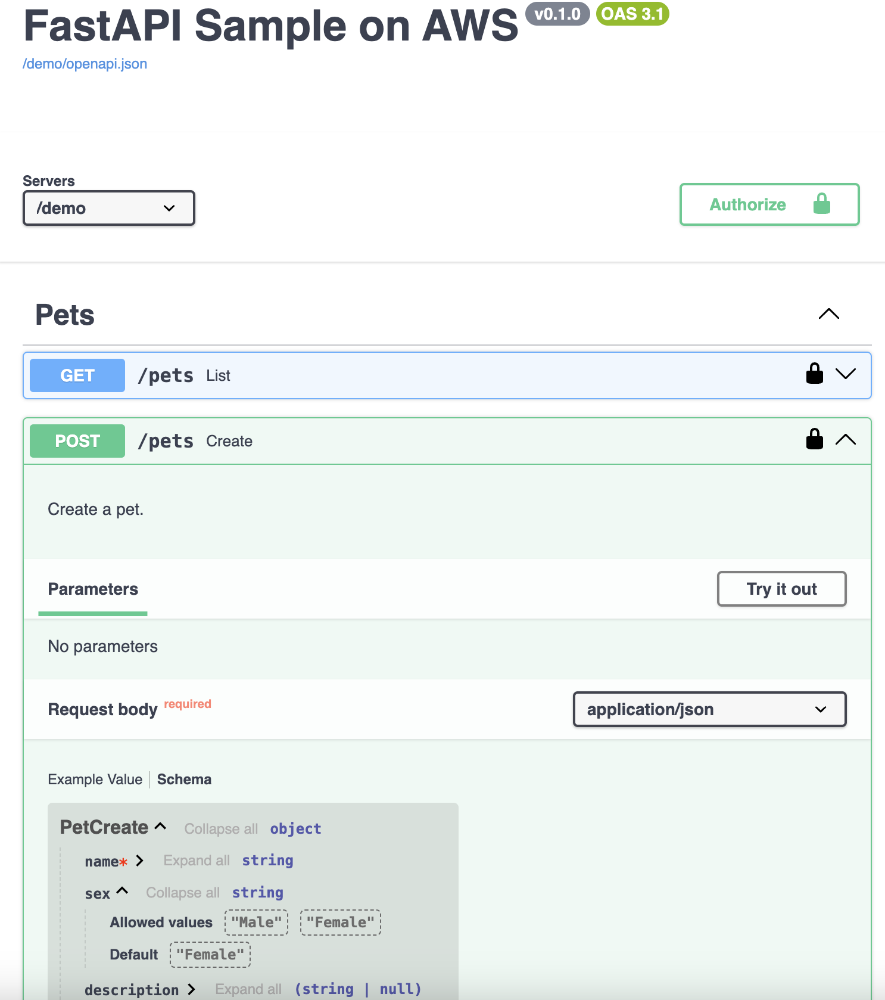

[English](README.md) | 简体中文

<p align="center">
    <h3 align="center">FastAPI Sample on AWS</h3>
</p>
<p align="center">FastAPI通过ApiGateway提供服务。</p>

<p align="center">
  <a href="https://nowfox.github.io/fastapi-sample-on-aws/zh/"><strong>文档</strong></a>
</p>

<p align="center">
  <a href="https://opensource.org/licenses/Apache-2.0"></a>
  <a href="https://github.com/nowfox/fastapi-sample-on-aws/releases"></a>
</p>


## 部署CDK模板
请确保安装了**docker**和**CDK**。

```bash
cd source/constructs
cdk deploy
```
部署完后后，您将得到DocUrl，点击后效果如下图：  
